# 🎓 InsightFlowEdu

*A Data-Driven Academic Insight and Intervention Platform*

## 🌟 Overview

InsightFlowEdu is a full-stack academic analytics platform that helps faculty identify at-risk students using performance, attendance, and feedback data.

Built using **React, TypeScript, Spring Boot, Oracle Database, and PL/SQL**, the platform provides actionable insights through dashboards, risk analysis, sentiment classification, and intervention tracking.

The project demonstrates:

* Software Engineering principles including requirements analysis, system design, use cases, class diagrams, and sequence diagrams.
* Database design using Oracle, normalization, PL/SQL procedures, triggers, and JDBC integration.
* Full-stack development using modern frontend and backend technologies.

---

## 🏗️ Architecture

### Frontend

* React + TypeScript
* Vite
* TanStack Query
* Tailwind CSS
* Recharts
* MSW (Mock Service Worker)

### Backend

* Spring Boot
* Java 21
* Spring Security
* Maven
* JDBC

### Database

* Oracle Database XE
* PL/SQL Procedures
* Functions
* Triggers
* Normalized Relational Schema

### Application Flow

```text
React UI
    ↓
Spring Boot REST APIs
    ↓
JDBC Layer
    ↓
Oracle Database
```

---

## 🧩 Key Features

### Student Performance Tracking

Tracks GPA and attendance trends across semesters.

### Risk Assessment Engine

Identifies students who may require academic intervention using PL/SQL-based evaluation logic.

### Feedback Sentiment Analysis

Classifies student feedback as positive, neutral, or negative using a database-driven sentiment function.

### Intervention Management

Allows faculty to record and review intervention activities for individual students.

### Analytics Dashboard

Provides visual summaries through charts, metrics, and performance indicators.

---

## 📸 Application Previews

> Screenshots below showcase the platform's UI across key modules.  
> The **Login** and **Get Started** pages appear identically in both light and dark mode.  
> The **Dashboard** is shown in both modes; all other modules are shown in light mode.

---

### 🔐 Login & Onboarding

| Get Started | Login / Welcome Back |
|:-----------:|:--------------------:|
| 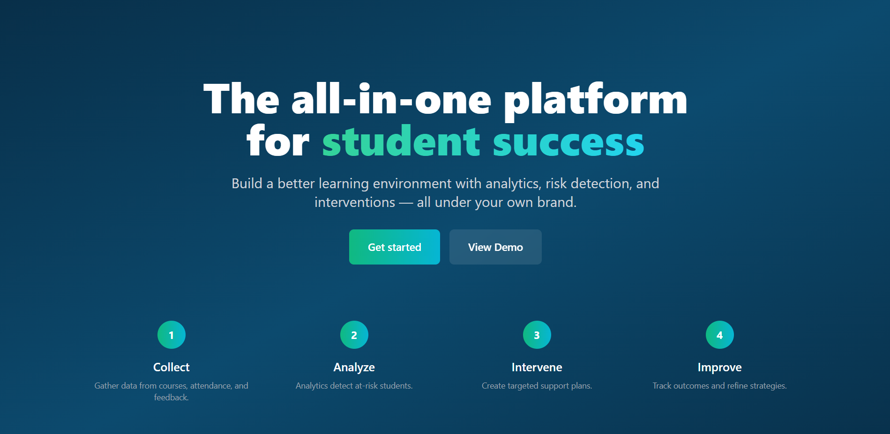 | 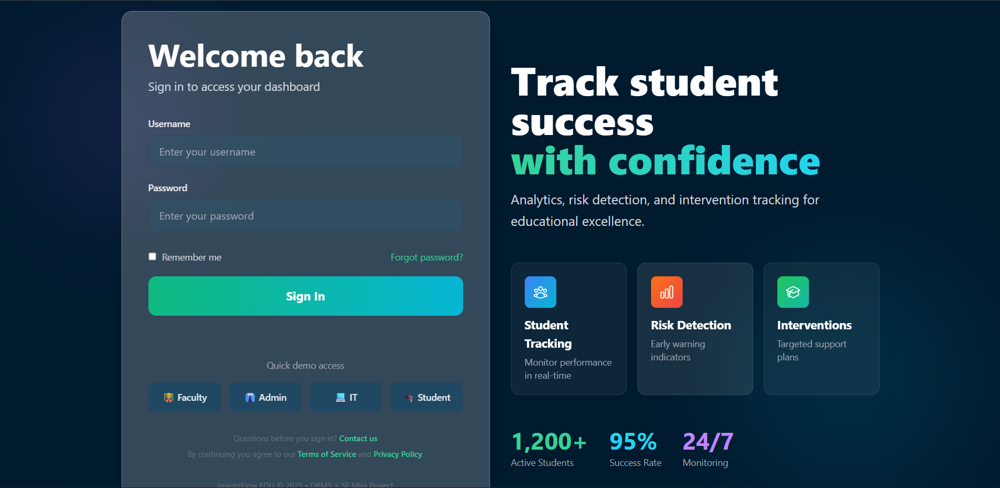 |

---

### 📊 Dashboard

| Light Mode | Dark Mode |
|:----------:|:---------:|
| 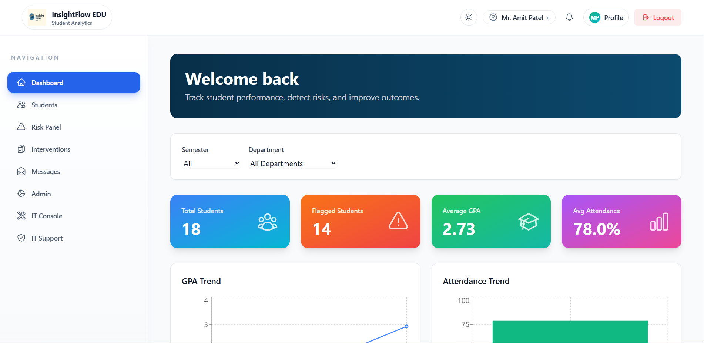 | 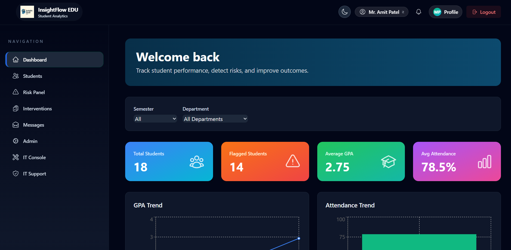 |

---

### 👥 Student & Admin Management

| Students Panel | Admin Panel |
|:--------------:|:-----------:|
| 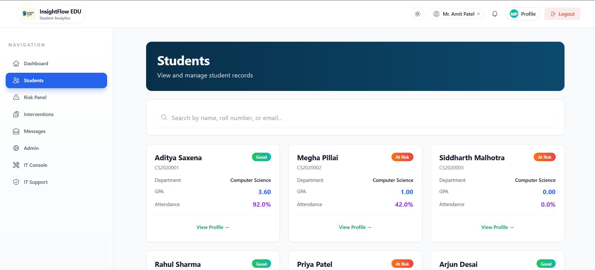 | 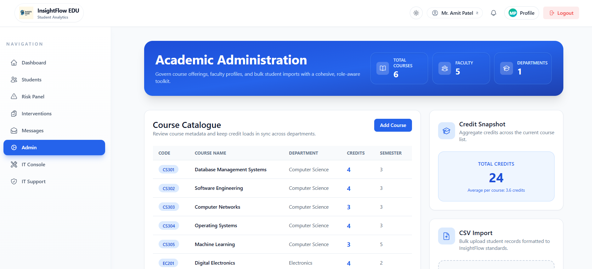 |

---

### ⚠️ Risk Analysis & Interventions

| Risk Panel | Interventions |
|:----------:|:-------------:|
| 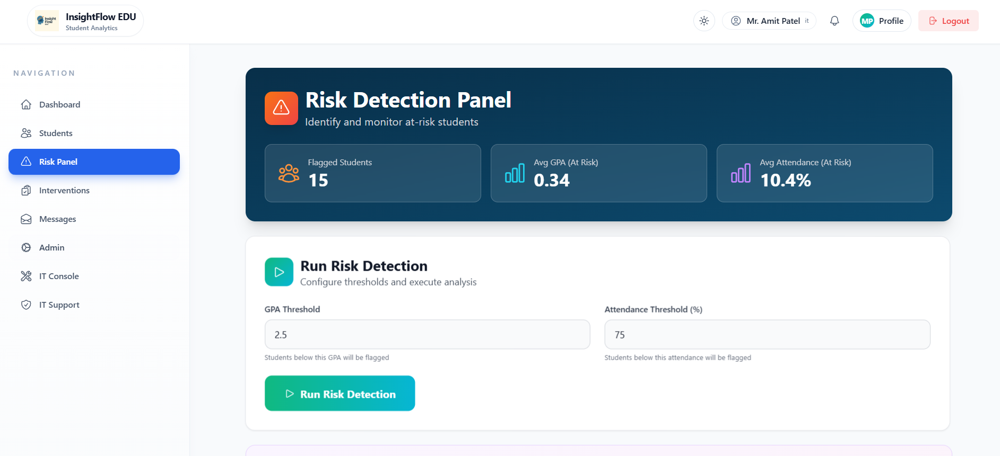 | 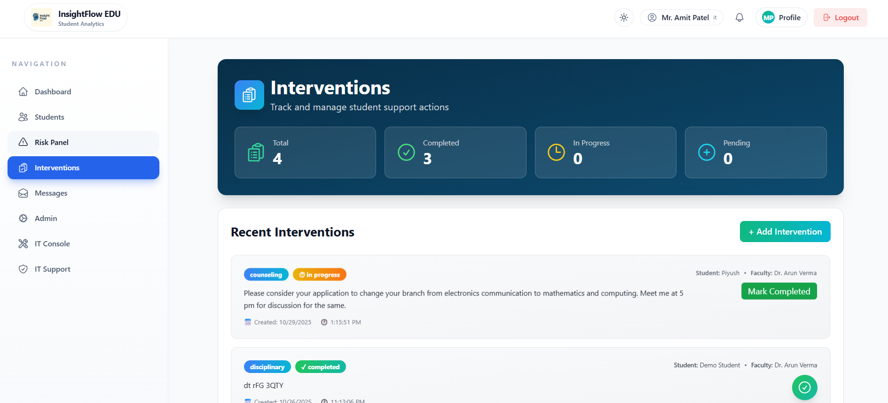 |

---

### 💬 Feedback & Messaging

| Feedback Analyzer | Messages |
|:-----------------:|:--------:|
| 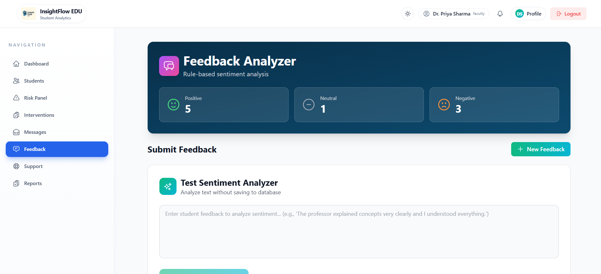 | 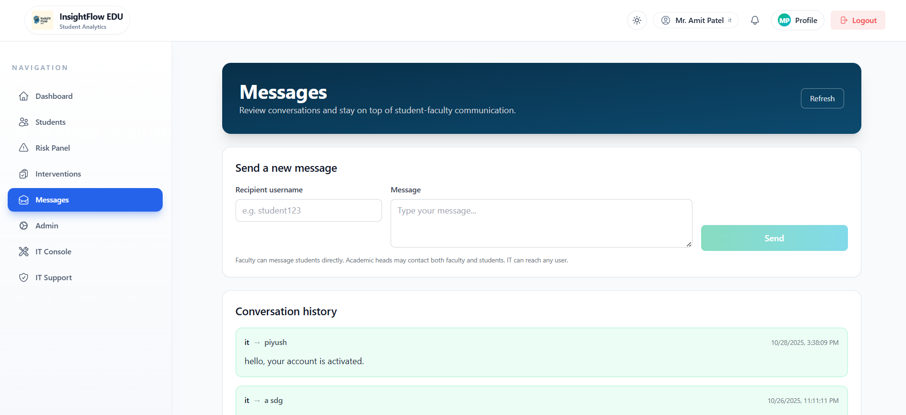 |

---

### 🛠️ IT & Support

| IT Console | IT Support |
|:----------:|:----------:|
| 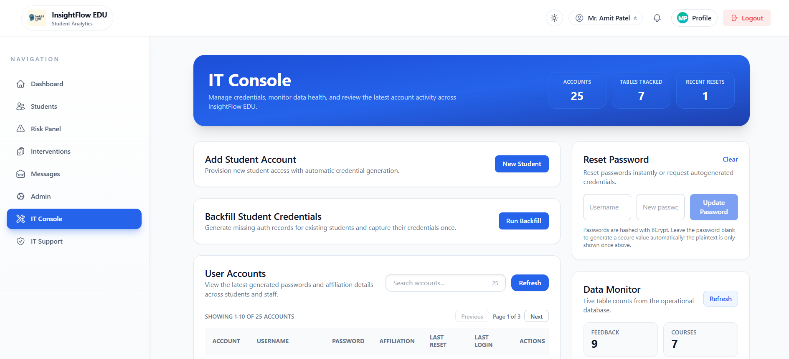 | 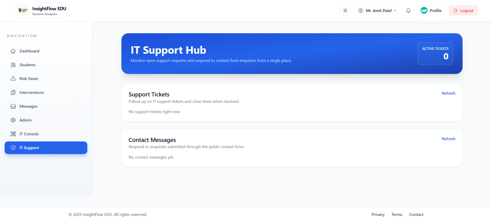 |

---

### 👤 Profile & Contact

| My Profile | Contact Us |
|:----------:|:----------:|
| 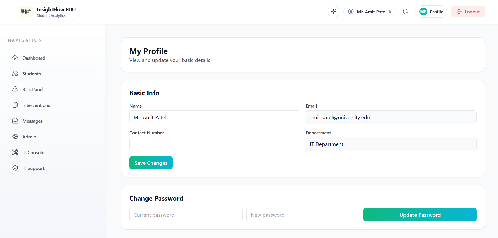 | 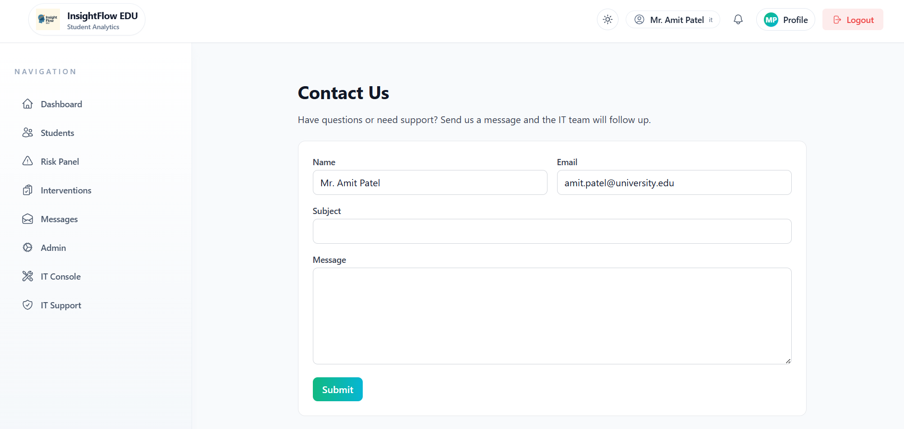 |

---

## ⚙️ Tech Stack

### Frontend

* React 18
* TypeScript
* Vite
* React Router
* TanStack Query
* Axios
* React Hook Form
* Zod
* Recharts
* Tailwind CSS
* Headless UI
* Framer Motion
* Jest
* React Testing Library
* MSW

### Backend

* Spring Boot
* Java 21
* Maven
* Spring Security
* Oracle JDBC Driver
* Lombok
* JUnit 5

### Database

* Oracle Database XE 21c
* PL/SQL
* SQL
* JDBC

### Development Tools

* IntelliJ IDEA
* VS Code
* Oracle SQL Developer
* Git

---

## 🧠 Database Design

The database layer includes:

* Fully normalized schema (3NF)
* Entity Relationship modeling
* Integrity constraints
* Stored procedures
* Functions
* Triggers

Implemented database objects include:

* `run_risk_engine`
* `classify_sentiment`
* `trg_interventions_timestamp`

---

## 🖥️ Core Modules

* Faculty Authentication
* Student Management
* Academic Performance Tracking
* Attendance Monitoring
* Risk Analysis Dashboard
* Feedback Sentiment Analysis
* Intervention Tracking
* Reporting & Analytics

---

## 🚀 Quick Start

### Frontend

```bash
cd frontend
npm install
npm run dev
```

### Backend

```bash
cd backend/insightflow-backend
mvn spring-boot:run
```

Configure the Oracle database connection before starting the backend application.

Additional setup information:

* Frontend: `frontend/README.md`
* Backend: `backend/insightflow-backend/README.md`

---

## 📁 Project Structure

```text
InsightFlow-Edu/
├── frontend/
│   ├── src/
│   ├── public/
│   └── package.json
│
├── backend/
│   └── insightflow-backend/
│       ├── src/
│       └── pom.xml
│
├── database/
│
├── images/
│   ├── get_started.png
│   ├── login.png
│   ├── dashboard_light.png
│   ├── dashboard_dark.png
│   ├── students_light.png
│   ├── admin_light.png
│   ├── Risk_panel_light.png
│   ├── interventions_light.png
│   ├── feedback_analyzer_light.png
│   ├── messages_light.png
│   ├── it_console_light.png
│   ├── IT_support_light.png
│   ├── my_profile_light.png
│   └── contact_us_light.png
│
├── SRS/
│
├── README.md
└── LICENSE
```

---

## 💼 Portfolio Highlights

* End-to-end full-stack application using React, TypeScript, Spring Boot, and Oracle Database.
* Database-driven risk assessment and sentiment analysis using PL/SQL.
* Secure password storage using BCrypt hashing.
* REST API architecture with frontend-backend integration.
* Offline frontend development and testing using MSW.
* Unit and component testing using Jest and React Testing Library.
* Software Engineering artifacts including SRS, class diagrams, and sequence diagrams.

---

## 📚 Documentation

* Frontend Documentation: `frontend/README.md`
* Backend Documentation: `backend/insightflow-backend/README.md`
* Database Scripts: `database/`
* Software Engineering Artifacts: `SRS/`

---

## 📌 Notes

This repository is intended for academic demonstration and portfolio purposes.

Certain authentication and security configurations are simplified to support local development and demonstration workflows.

---
